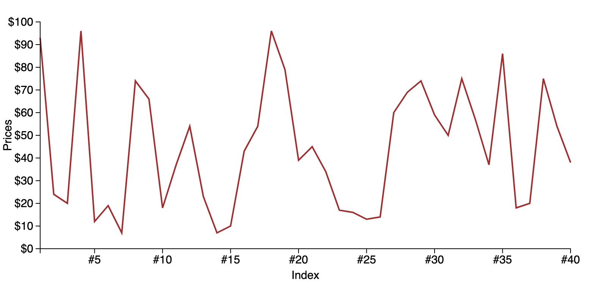
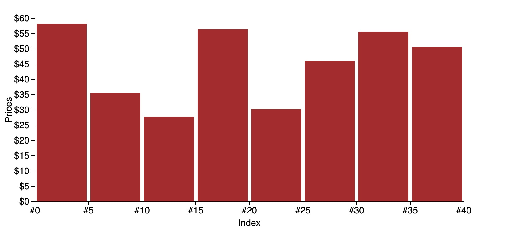
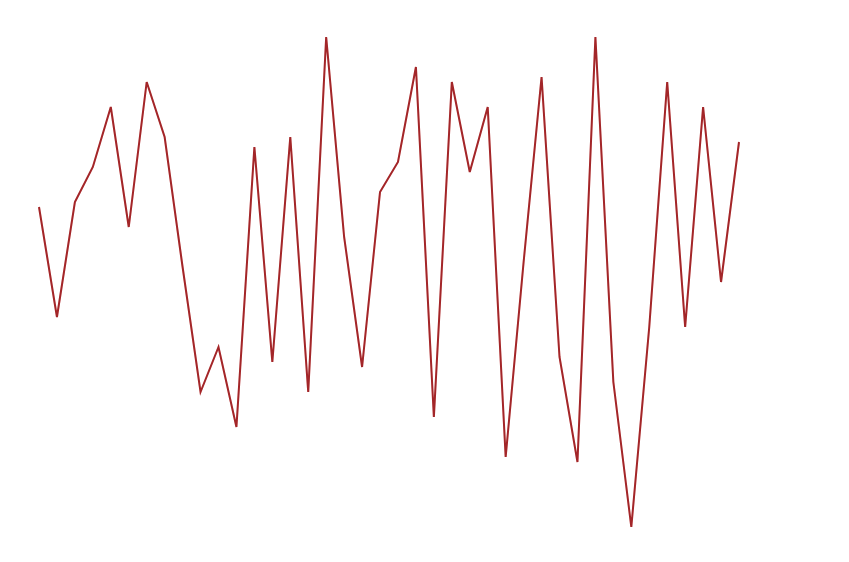

# d3-examples

D3 examples with step by step tutorial.

The intention of this repo is to create an step by step tutorial for some d3-examples. Each step is explained so that you could know why should we do this.

Each example has its own folder. And the html file, javascript file, css file, data/data generator file, docs should be included in each file. If you want to check one example, go to that folder and open the `index.html`.

## Basic line chart

## Basic bar chart

## Shapes

### Line

