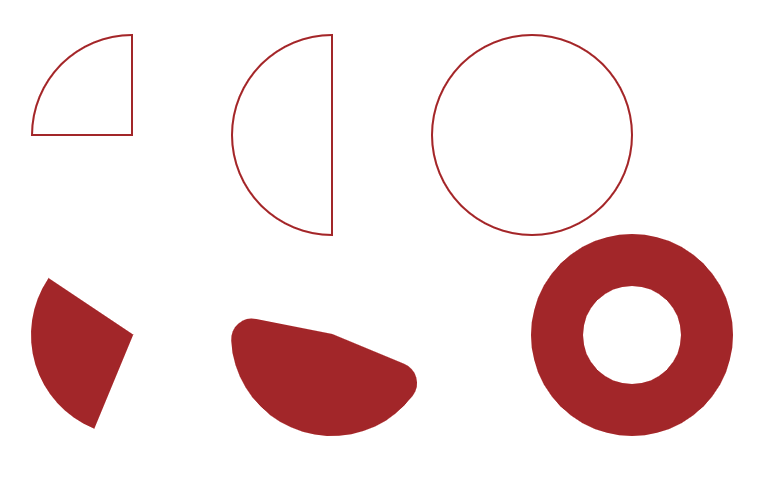

# d3.shape - arc

The arc is

## Example



## Draw the Arc

```javascript
// create the arc generator
const arc = d3.arc()
// set the inner Radius and the outer Radius
arc.innerRadius(0).outerRadius(100)

// create arc path
const cornorArc = arc({
  startAngle: (Math.PI * 3) / 2,
  endAngle: Math.PI * 2,
})

// draw the arc
ctr
  .append('path')
  .attr('d', cornorArc)
  .attr('fill', 'none')
  .attr('stroke', 'Brown')
  .attr('stroke-width', 2)
  .attr('transform', `translate(100, 100)`)
```

See the usage for different examples.
