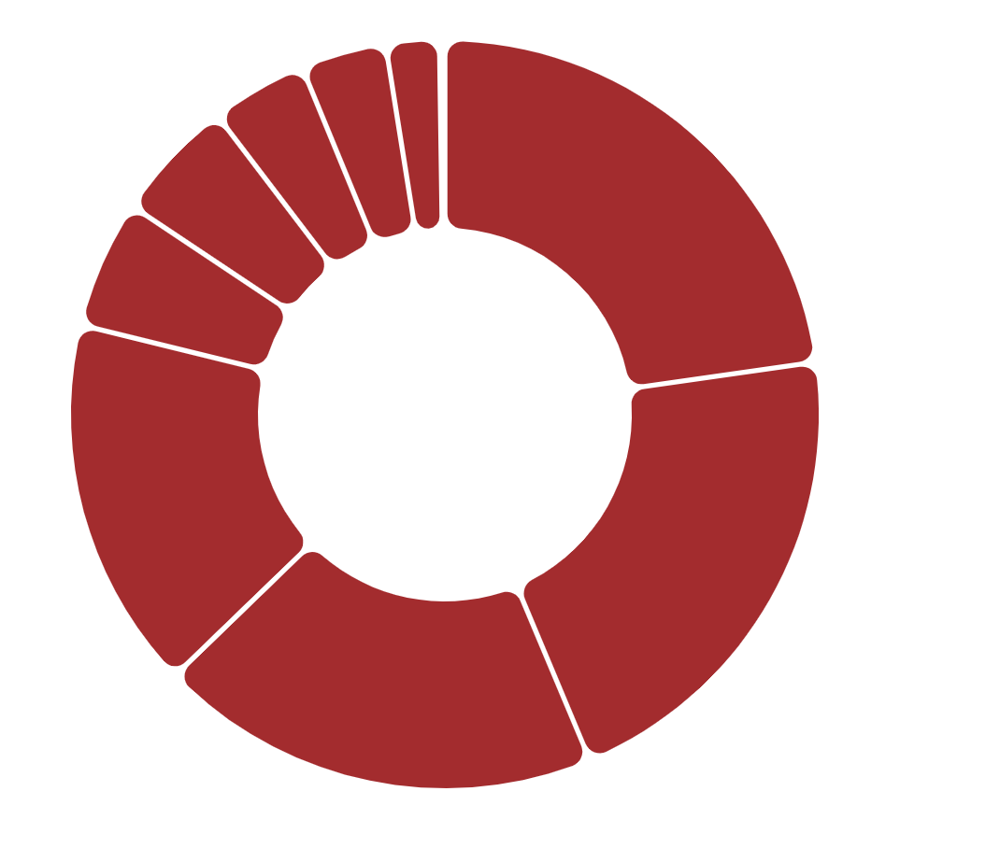

# d3.shape - pie

This is an example for a pie shape. The pie is to show the percentage for the data. So we need an array of data.

## Example



## Draw the pie

sort() and sortValues() control the order of the data.
startAngle and endAngle control the angle of the pie.
padAngle control the space between the pie and the text.

See the arcs for more information about the arcs to draw.

```javascript
const arcs = d3
  .pie()
  // .sort((a, b) => a.value - b.value)
  // .sortValues((a, b) => a - b)
  // .startAngle((3 / 16) * Math.PI)
  // .endAngle((27 / 16) * Math.PI)
  // .padAngle(0.01)
  .value((d) => d.value)(dataset)

arcPie = d3
  .arc()
  .innerRadius(100)
  .outerRadius(200)
  .padRadius(200)
  .padAngle(2 / 150)
  .cornerRadius(8)
```
